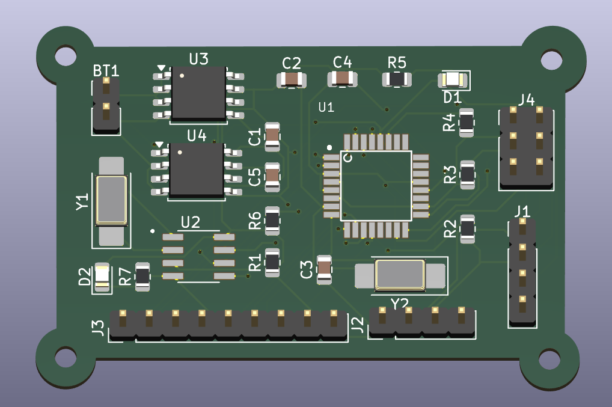
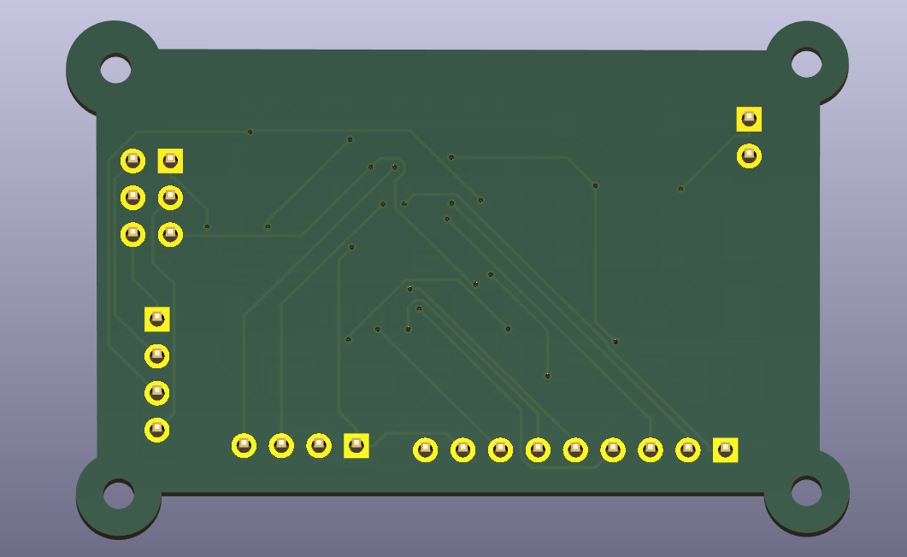

# MCU Data Logger PCB

A custom PCB designed in KiCad for an ATmega328P-based MCU Data Logger. This project demonstrates the complete PCB design workflow, from schematic capture and PCB layout to 4-layer stackup conversion and Gerber generation for fabrication.

---

## Project Overview

This project includes:

- Complete schematic design
- Footprint assignment
- 2-layer PCB layout
- Conversion to 4-layer PCB stackup
- Design Rule Check (DRC)
- Copper pour
- Gerber generation
- Git version control

---

## Hardware Used

| Component | Description |
|------------|-------------|
| ATmega328P-AU | Main Microcontroller |
| DS1337S+ | Real-Time Clock (RTC) |
| 24LC1025 | EEPROM |
| 16 MHz Crystal | MCU Clock |
| 32.768 kHz Crystal | RTC Clock |
| LEDs | Status Indicators |
| Pin Headers | Programming & Communication |
| Battery Connector | Power Input |

---

## PCB Specifications

| Parameter | Value |
|-----------|-------|
| PCB Software | KiCad |
| Board Size | Approx. 127 × 96 mm |
| Initial Design | 2 Layers |
| Final Design | 4 Layers |
| Copper Pour | Yes |
| DRC Status | No Errors |
| Gerber Files | Generated |

---

# Project Images

## Schematic


---

## PCB Top View


---

## PCB Bottom View


---

## 3D View (Top)



---

## 3D View (Bottom)



---

## 4-Layer Stackup


---

## Gerber Preview


---

# Folder Structure

```
MCU-data-logger/
│
├── Images/
├── Documentation/
├── Gerbers_4layers/
├── production/
├── Libraries/
├── MCU data logger.kicad_pcb
├── MCU data logger.kicad_sch
├── README.md
└── .gitignore
```

---

# Design Workflow

- Created schematic
- Assigned footprints
- Imported netlist into PCB Editor
- Component placement
- Manual routing
- Copper fill
- Design Rule Check (DRC)
- Generated Gerber files
- Converted design to a 4-layer PCB stackup
- Generated final manufacturing files

---

# Manufacturing Outputs

The repository includes:

- Gerber Files
- Drill Files
- Copper Layers
- Silkscreen Layers
- Solder Mask
- Board Outline

These files are located inside the **Gerbers_4layers** directory.

---

# Tools Used

- KiCad
- Git
- GitHub

---

# Learning Outcomes

Through this project, I gained hands-on experience in:

- PCB schematic design
- PCB layout
- Component placement
- PCB routing
- Copper pours
- Design Rule Checking (DRC)
- Gerber generation
- Multi-layer PCB stackup
- Git version control

---

# Future Improvements

- Improve signal routing
- Power integrity optimization
- Differential pair routing
- High-speed design practices
- EMI/EMC optimization

---

## Author

**Chislon L Joseph**

B.Tech Electronics and Communication Engineering

Cochin University of Science and Technology (CUSAT)

---

## License

This project is intended for educational and learning purposes.